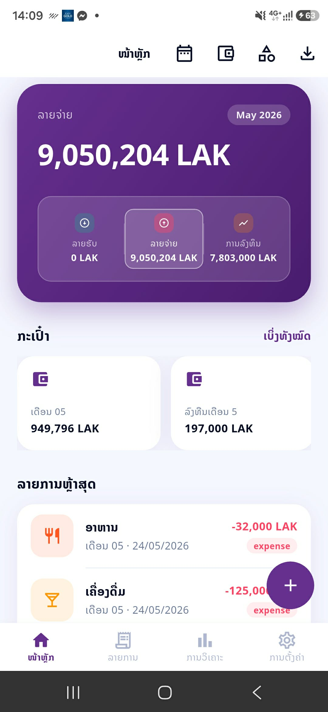
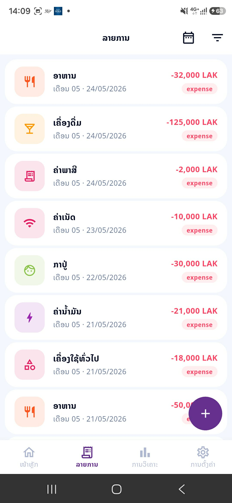
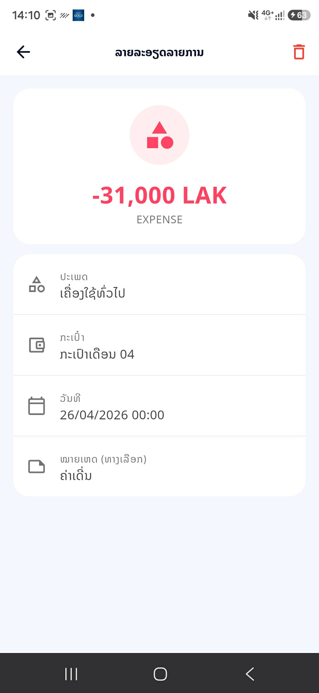
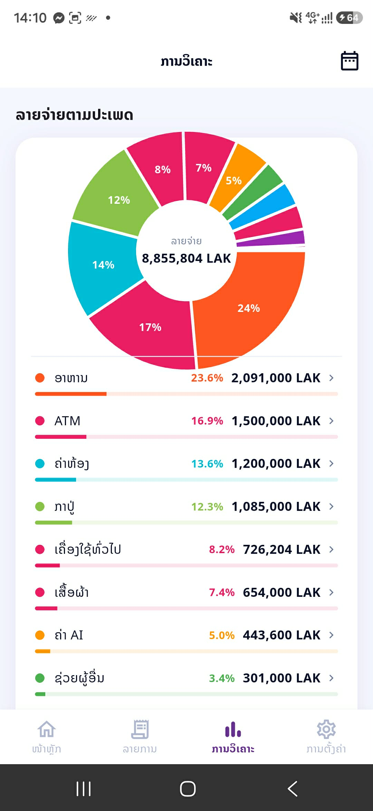
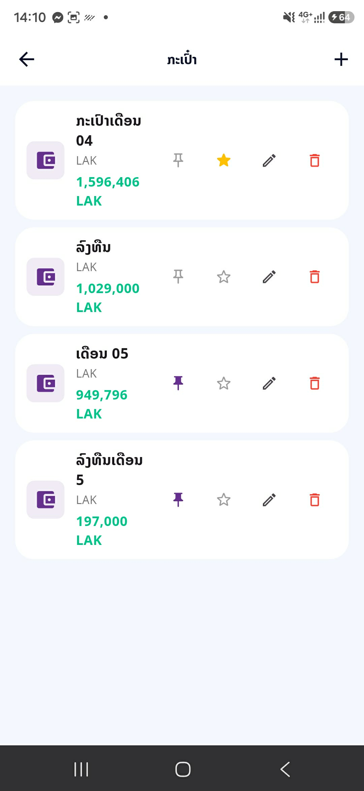
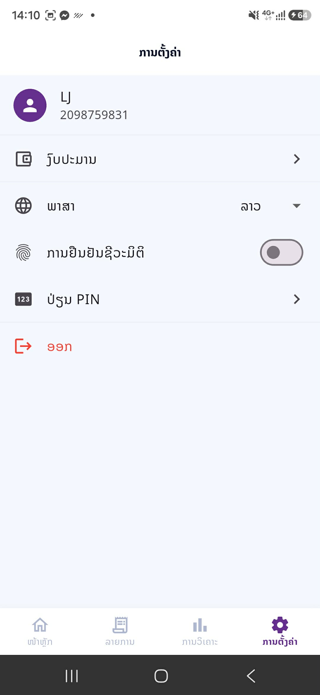

# Personal Finance — Mobile App

> Cross-platform Flutter app for tracking income, expenses, budgets, and wallets — with intelligent **slip parsing** that extracts transactions from photographed bank receipts using on-device OCR.

Backend repository: [`personal-finance-backend`](../backend) (Express + MongoDB + S3)

---

## Table of Contents

- [Overview](#overview)
- [Screenshots](#screenshots)
- [Features](#features)
- [Tech Stack](#tech-stack)
- [Platforms](#platforms)
- [Getting Started](#getting-started)
- [Configuration](#configuration)
- [Project Structure](#project-structure)
- [Slip Parser](#slip-parser)

---

## Overview

A personal-finance manager built around three ideas:

1. **Frictionless transaction entry** — snap a photo of a bank slip and the app extracts amount, date, and merchant automatically via Google ML Kit OCR (supports English, Lao, and Thai text).
2. **Multi-wallet, multi-category** — track cash, bank accounts, and credit cards separately; budget per category per month.
3. **Privacy first** — secure JWT storage in `flutter_secure_storage`; optional biometric (fingerprint / Face ID) lock screen.

The app is bilingual (English + Lao) and ships for iOS, Android, macOS, and Web.

---

## Screenshots

> Screens captured on iPhone 15 Pro at 1179×2556. See [`docs/screenshots/README.md`](docs/screenshots/README.md) for the capture checklist.

### Home — Wallet Overview


### Transactions — List & Detail


### Add Transaction — Slip Parser


### Budgets — Per-Category Tracking


### Analytics — Spending Breakdown


### Wallets — Multi-Account Management


### Biometric Lock Screen


---

## Features

- **Authentication** — phone + PIN registration/login; biometric unlock (Face ID / fingerprint)
- **Wallets** — create unlimited wallets (cash, bank, card), each with its own balance and currency
- **Transactions** — income, expense, transfer between wallets; attach photographed slip
- **Slip OCR** — Google ML Kit Text Recognition extracts amount / date / merchant from bank receipts (EN / LO / TH)
- **Categories** — customizable, with color + icon
- **Budgets** — monthly budget per category with spending status (under / near limit / over)
- **Analytics** — category breakdown, monthly trends, top expenses (powered by `fl_chart`)
- **Export** — download statements as Excel or PDF
- **i18n** — English + Lao (ພາສາລາວ)
- **Secure storage** — JWT held in `flutter_secure_storage` (Keychain / Keystore)

---

## Tech Stack

| Layer | Technology |
|---|---|
| Framework | Flutter 3.0+ (Dart) |
| State management | Provider (ChangeNotifier) |
| HTTP client | Dio |
| OCR | `google_mlkit_text_recognition` |
| Charts | `fl_chart` |
| Secure storage | `flutter_secure_storage` |
| Biometrics | `local_auth` |
| Image input | `image_picker` |
| Local prefs | `shared_preferences` |
| Image caching | `cached_network_image` |
| Localization | `intl` |

---

## Platforms

| Platform | Supported |
|---|:---:|
| iOS | ✅ |
| Android | ✅ |
| macOS | ✅ |
| Web | ✅ |
| Windows / Linux | — |

---

## Getting Started

### Prerequisites

- [Flutter SDK](https://docs.flutter.dev/get-started/install) ≥ 3.0
- Platform toolchains:
  - **iOS**: Xcode 15+ + CocoaPods
  - **Android**: Android Studio + SDK 33+
  - **Web**: any modern browser
- Backend API running (see `../backend`)

### Install

```bash
cd frontend
flutter pub get
```

### Run

```bash
flutter run                 # connected device / emulator
flutter run -d chrome       # web
flutter run -d macos        # macOS desktop
```

### Build

```bash
flutter build apk           # Android
flutter build ios           # iOS (release; needs Xcode signing)
flutter build web           # Web → build/web
flutter build macos
```

### Test & lint

```bash
flutter test
flutter analyze
```

---

## Configuration

The API base URL lives in `lib/services/api_service.dart`. Point it at your backend:

```dart
const String API_BASE_URL = "http://localhost:7001/api";
```

For production, replace with the deployed API URL.

> **Tip:** consider externalizing this via `--dart-define=API_BASE_URL=...` so you don't edit source between environments.

---

## Project Structure

```
frontend/
├── lib/
│   ├── main.dart
│   ├── models/             # Transaction, Wallet, Budget, Category, User
│   ├── screens/
│   │   ├── auth/               # Login, Register, PIN, LockScreen
│   │   ├── home/
│   │   ├── transactions/
│   │   ├── wallets/
│   │   ├── categories/
│   │   ├── budgets/
│   │   ├── analytics/
│   │   ├── export/
│   │   └── settings/
│   ├── services/           # api_service, auth_service, storage
│   ├── providers/          # ChangeNotifier state classes
│   ├── widgets/            # Shared UI components
│   ├── utils/
│   │   └── slip_parser.dart    # OCR → Transaction extraction
│   └── theme/
├── assets/                 # Fonts, icons, images
├── ios/
├── android/
├── macos/
├── web/
└── pubspec.yaml
```

---

## Slip Parser

The slip parser (`lib/utils/slip_parser.dart`) is the most distinctive feature of the app:

1. User taps **+ Add Transaction → From Slip**
2. Camera or gallery image picked via `image_picker`
3. Image fed to Google ML Kit `TextRecognizer` (on-device, no network required)
4. Regex-based extraction:
   - **Amount** — currency-prefixed or trailing decimal patterns
   - **Date** — `dd/mm/yyyy`, `yyyy-mm-dd`, and Lao month names
   - **Merchant** — top-line heuristic (largest text block above amount)
5. Pre-filled form opens for user confirmation before save

Supports text in English, Lao, and Thai.

---

## License

MIT.
